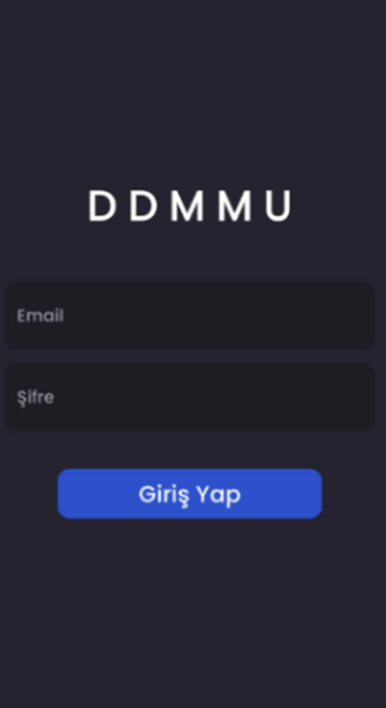
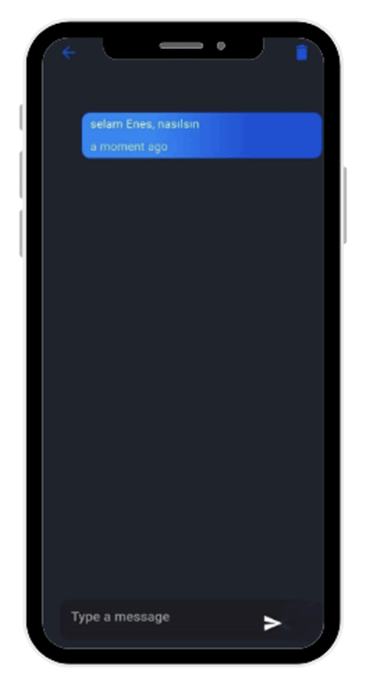
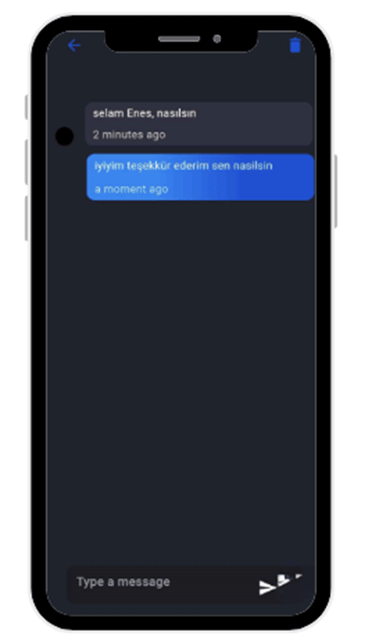

# ChatFirebase Mobil Mesajlaşma Uygulaması

ChatFirebase, Firebase destekli bir mobil mesajlaşma uygulamasıdır. Bu uygulama, Flutter ile geliştirilmiş olup, Firebase'in güçlü altyapısını kullanarak hızlı ve güvenli bir şekilde mesajlaşma imkanı sunar.

## Proje Detay Resimleri
 

 

## Özellikler

- Gerçek zamanlı mesajlaşma
- Kullanıcılar arası mesajlaşmada yüksek performans ve güvenlik
- Kolay kullanımlı arayüz

## Kullanılan Teknolojiler

- **Flutter**: Uygulama geliştirme için kullanılan framework.
- **Firebase**: Veritabanı ve kimlik doğrulama işlemleri için kullanılan platform.
- **Provider**: Uygulama içi state yönetimi için kullanılan paket.
- **Get_it**: Dependency injection için kullanılan paket.

## Proje Yapısı
### Dosyalar ve Klasörler

- **/models**: Uygulama modellerini içerir.
- **/pages**: Uygulamanın sayfa tasarımlarını içerir.
- **/providers**: State yönetimi için provider yapılarını barındırır.
- **/services**: Uygulamanın servis işlemleri, örneğin `navigation_service.dart` dosyasında navigasyon işlemleri yer alır.
- **/widgets**: Yeniden kullanılabilir widget'lar bu klasör altında bulunur.
- **main.dart**: Uygulamanın başlangıç noktası.
- **firebase_options.dart**: Firebase yapılandırma dosyası.
- **theme_controller.dart**: Tema yönetimini sağlayan dosya.
